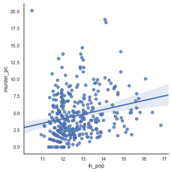
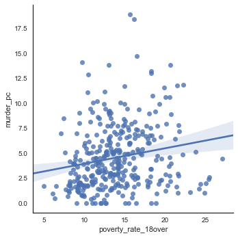
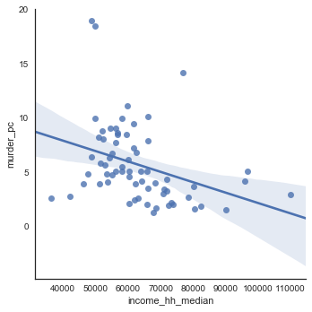
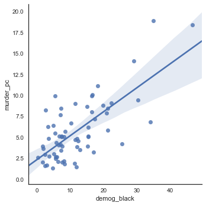

## Contents
{:.no_toc}
*  
{: toc}

## Murder rates
The analysis that follows is restricted to pooled 2006-2014 data in order to avoid peeking at our test set.
A histogram of murder rates shows importance of right-tail of distribution.
**The model will need to predict cities with much higher murder rates than the median.**

*Figure 1: Murder rates skew large, so the best model will predict wide variation.*

Fixed "year" effects are probably an important part of a prediction model.
The median and mean number of murders varies by about 25% peak to trough over the 10 years.
For out-of-sample predictions in new years, however, these cross-city effects would make predictive models weaker unless 
(1) national trends can be predicted, or 
(2) national trends are a function of or endogenous to local variables like economic conditions at the city level.

*Figure 1: Total murders vary substantially across years with a clear trend*

## Murder rates and metro characteristics

Metro areas with higher populations have more crime (in line with theory), but nevertheless does not explain significant variance and is not a sufficient predictor by itself.

*Figure 3: Murders scale faster than linearly in population*

Median HH income appears to be a strong predictor of murder rates, but the relationship may not be linear.
The variable's predictive power may be strongest in conjunction with other variables.

*Figure 4:  Income and poverty are also clear predictors of murder rates*

With respect to race, the proportion of African American population in a city is strongly (positively) associated with higher murder rates.

*Figure 5: Racial composition also predicts murder rates sharply*

## Strength of observed relationships

For cities without missing data in the preceding predictor variables, a simple OLS model achieved an $R^2$ of 0.664, although variables like population and income do not have a statistically significant relationship with the murder rate in this model.
**In other words, the relationships described above are largely "absorbed" by demographic variables, particularly racial composition.**
When only population and poverty rate are included in an OLS prediction model, the $R^2$ falls to 0.128, suggesting the importance of interactive effects.

## Conclusion

We will try to forecast the number of murders for the subsequent year. We’ll test set R2  to assess performance. The EDA highlights the strong skew of the murder rate, which suggests different types of models would perform better in the high-crime metro areas than in low-crime metro areas. This suggests we should explore ensemble methods. 
