## Contents
{:.no_toc}
*  
{: toc}


```python
import numpy as np
import pandas as pd
import matplotlib
import matplotlib.pyplot as plt

from IPython.display import Image
from IPython.display import display

%matplotlib inline

import statsmodels.api as sm
from statsmodels.api import OLS


import seaborn as sns
sns.set(style="whitegrid", color_codes=True)
import warnings
warnings.filterwarnings('ignore')
```


```python

df_crime = pd.read_csv("../Processed Data/crimeAndCensus.csv")
```


```python
missing = df_crime.agg(func = lambda x: np.mean(pd.isnull(x)))
```


```python

missing.hist(bins=50)

```


    <matplotlib.axes._subplots.AxesSubplot at 0x11f12f5c0>


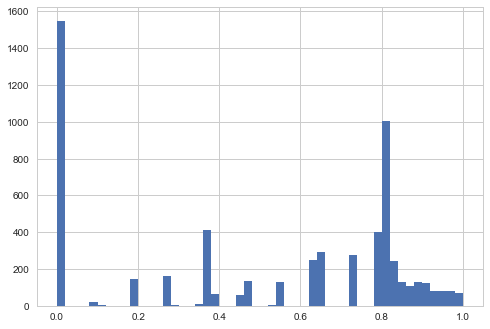


```python
np.sum(missing < .20)
```


    1719


```python
missing[ missing < .20]
```


    msa_fbi              0.000000
    population_fbi       0.000000
    murder_fbi           0.000267
    year                 0.000000
    geoid                0.000000
    GEO.display-label    0.010948
    GEO.id               0.010948
    GEO.id2              0.010948
    S01_HC01_EST_VC01    0.010948
    S01_HC01_EST_VC03    0.010948
    S01_HC01_EST_VC04    0.010948
    S01_HC01_EST_VC05    0.010948
    S01_HC01_EST_VC06    0.010948
    S01_HC01_EST_VC07    0.010948
    S01_HC01_EST_VC08    0.010948
    S01_HC01_EST_VC09    0.010948
    S01_HC01_EST_VC10    0.010948
    S01_HC01_EST_VC11    0.010948
    S01_HC01_EST_VC12    0.010948
    S01_HC01_EST_VC13    0.010948
    S01_HC01_EST_VC14    0.010948
    S01_HC01_EST_VC15    0.010948
    S01_HC01_EST_VC16    0.010948
    S01_HC01_EST_VC17    0.010948
    S01_HC01_EST_VC18    0.010948
    S01_HC01_EST_VC19    0.010948
    S01_HC01_EST_VC20    0.010948
    S01_HC01_EST_VC23    0.010948
    S01_HC01_EST_VC24    0.010948
    S01_HC01_EST_VC25    0.010948
                           ...   
    S25_HC03_EST_VC06    0.010948
    S25_HC03_EST_VC09    0.010948
    S25_HC03_EST_VC10    0.010948
    S25_HC03_EST_VC14    0.010948
    S25_HC03_EST_VC15    0.010948
    S25_HC03_EST_VC16    0.010948
    S25_HC03_EST_VC17    0.010948
    S25_HC03_EST_VC18    0.010948
    S25_HC03_EST_VC19    0.010948
    S25_HC03_EST_VC20    0.010948
    S25_HC03_EST_VC21    0.010948
    S25_HC03_EST_VC22    0.010948
    S25_HC03_EST_VC23    0.010948
    S25_HC03_EST_VC24    0.010948
    S25_HC03_EST_VC25    0.010948
    S25_HC03_EST_VC26    0.010948
    S25_HC03_EST_VC27    0.010948
    S25_HC03_EST_VC28    0.010948
    S25_HC03_EST_VC29    0.010948
    S25_HC03_EST_VC30    0.010948
    S25_HC03_EST_VC31    0.010948
    S25_HC03_EST_VC32    0.010948
    S25_HC03_EST_VC33    0.010948
    S25_HC03_EST_VC34    0.010948
    S25_HC03_EST_VC36    0.010948
    S25_HC03_EST_VC39    0.010948
    S25_HC03_EST_VC40    0.010948
    S25_HC03_EST_VC41    0.010948
    S25_HC03_EST_VC42    0.010948
    S25_HC03_EST_VC44    0.010948
    Length: 1719, dtype: float64


```python

df_crime['murder_pc'] = df_crime['murder_fbi'] / df_crime['population_fbi'] * 100000
df_crime['ln_pop'] = np.log(df_crime['population_fbi'])

df_crime['murder_fbi_smallcity'] = df_crime['murder_fbi'].where(df_crime['population_fbi'] < 100000, df_crime['murder_fbi']) 


df_crime.head(10)


```


<div>
<style>
    .dataframe thead tr:only-child th {
        text-align: right;
    }

    .dataframe thead th {
        text-align: left;
    }

    .dataframe tbody tr th {
        vertical-align: top;
    }
</style>
<table border="1" class="dataframe">
  <thead>
    <tr style="text-align: right;">
      <th></th>
      <th>msa_fbi</th>
      <th>population_fbi</th>
      <th>murder_fbi</th>
      <th>year</th>
      <th>geoid</th>
      <th>GEO.display-label</th>
      <th>GEO.id</th>
      <th>GEO.id2</th>
      <th>S01_HC01_EST_VC01</th>
      <th>S01_HC01_EST_VC03</th>
      <th>...</th>
      <th>S28_HC02_EST_VC31</th>
      <th>S28_HC02_EST_VC32</th>
      <th>S28_HC02_EST_VC33</th>
      <th>S28_HC02_EST_VC34</th>
      <th>S28_HC02_EST_VC35</th>
      <th>S28_HC02_EST_VC36</th>
      <th>S28_HC02_EST_VC37</th>
      <th>murder_pc</th>
      <th>ln_pop</th>
      <th>murder_fbi_smallcity</th>
    </tr>
  </thead>
  <tbody>
    <tr>
      <th>0</th>
      <td>Abilene, TX</td>
      <td>169885.0</td>
      <td>11.0</td>
      <td>2016</td>
      <td>10180.0</td>
      <td>Abilene, TX Metro Area</td>
      <td>310M300US10180</td>
      <td>10180.0</td>
      <td>170860.0</td>
      <td>6.4</td>
      <td>...</td>
      <td>0.4</td>
      <td>74.3</td>
      <td>25.4</td>
      <td>(X)</td>
      <td>0.0</td>
      <td>84.9</td>
      <td>15.1</td>
      <td>6.474968</td>
      <td>12.042877</td>
      <td>11.0</td>
    </tr>
    <tr>
      <th>1</th>
      <td>Akron, OH</td>
      <td>703561.0</td>
      <td>41.0</td>
      <td>2016</td>
      <td>10420.0</td>
      <td>Akron, OH Metro Area</td>
      <td>310M300US10420</td>
      <td>10420.0</td>
      <td>702221.0</td>
      <td>5.4</td>
      <td>...</td>
      <td>1.3</td>
      <td>75.8</td>
      <td>22.9</td>
      <td>(X)</td>
      <td>0.4</td>
      <td>94.2</td>
      <td>5.4</td>
      <td>5.827498</td>
      <td>13.463910</td>
      <td>41.0</td>
    </tr>
    <tr>
      <th>2</th>
      <td>Albany, GA</td>
      <td>152566.0</td>
      <td>18.0</td>
      <td>2016</td>
      <td>10500.0</td>
      <td>Albany, GA Metro Area</td>
      <td>310M300US10500</td>
      <td>10500.0</td>
      <td>152506.0</td>
      <td>6.0</td>
      <td>...</td>
      <td>0.3</td>
      <td>76.4</td>
      <td>23.3</td>
      <td>(X)</td>
      <td>0.0</td>
      <td>92.8</td>
      <td>7.2</td>
      <td>11.798173</td>
      <td>11.935353</td>
      <td>18.0</td>
    </tr>
    <tr>
      <th>3</th>
      <td>Albany, OR</td>
      <td>122030.0</td>
      <td>0.0</td>
      <td>2016</td>
      <td>10540.0</td>
      <td>Albany, OR Metro Area</td>
      <td>310M300US10540</td>
      <td>10540.0</td>
      <td>122849.0</td>
      <td>6.2</td>
      <td>...</td>
      <td>0.6</td>
      <td>80.5</td>
      <td>18.9</td>
      <td>(X)</td>
      <td>0.4</td>
      <td>93.9</td>
      <td>5.8</td>
      <td>0.000000</td>
      <td>11.712022</td>
      <td>0.0</td>
    </tr>
    <tr>
      <th>4</th>
      <td>Albany-Schenectady-Troy, NY</td>
      <td>878166.0</td>
      <td>18.0</td>
      <td>2016</td>
      <td>10580.0</td>
      <td>Albany-Schenectady-Troy, NY Metro Area</td>
      <td>310M300US10580</td>
      <td>10580.0</td>
      <td>881839.0</td>
      <td>5.3</td>
      <td>...</td>
      <td>0.4</td>
      <td>81.7</td>
      <td>17.9</td>
      <td>(X)</td>
      <td>0.1</td>
      <td>95.2</td>
      <td>4.7</td>
      <td>2.049726</td>
      <td>13.685591</td>
      <td>18.0</td>
    </tr>
    <tr>
      <th>5</th>
      <td>Albuquerque, NM</td>
      <td>907140.0</td>
      <td>75.0</td>
      <td>2016</td>
      <td>10740.0</td>
      <td>Albuquerque, NM Metro Area</td>
      <td>310M300US10740</td>
      <td>10740.0</td>
      <td>913924.0</td>
      <td>5.8</td>
      <td>...</td>
      <td>0.7</td>
      <td>78.0</td>
      <td>21.3</td>
      <td>(X)</td>
      <td>0.5</td>
      <td>93.1</td>
      <td>6.5</td>
      <td>8.267743</td>
      <td>13.718052</td>
      <td>75.0</td>
    </tr>
    <tr>
      <th>6</th>
      <td>Alexandria, LA</td>
      <td>154032.0</td>
      <td>12.0</td>
      <td>2016</td>
      <td>10780.0</td>
      <td>Alexandria, LA Metro Area</td>
      <td>310M300US10780</td>
      <td>10780.0</td>
      <td>154789.0</td>
      <td>6.7</td>
      <td>...</td>
      <td>0.0</td>
      <td>76.0</td>
      <td>24.0</td>
      <td>(X)</td>
      <td>0.7</td>
      <td>92.6</td>
      <td>6.7</td>
      <td>7.790589</td>
      <td>11.944916</td>
      <td>12.0</td>
    </tr>
    <tr>
      <th>7</th>
      <td>Allentown-Bethlehem-Easton, PA-NJ</td>
      <td>831770.0</td>
      <td>22.0</td>
      <td>2016</td>
      <td>10900.0</td>
      <td>Allentown-Bethlehem-Easton, PA-NJ Metro Area</td>
      <td>310M300US10900</td>
      <td>10900.0</td>
      <td>835652.0</td>
      <td>5.3</td>
      <td>...</td>
      <td>0.9</td>
      <td>79.2</td>
      <td>19.9</td>
      <td>(X)</td>
      <td>0.3</td>
      <td>94.9</td>
      <td>4.8</td>
      <td>2.644962</td>
      <td>13.631311</td>
      <td>22.0</td>
    </tr>
    <tr>
      <th>8</th>
      <td>Altoona, PA</td>
      <td>124942.0</td>
      <td>1.0</td>
      <td>2016</td>
      <td>11020.0</td>
      <td>Altoona, PA Metro Area</td>
      <td>310M300US11020</td>
      <td>11020.0</td>
      <td>124650.0</td>
      <td>5.4</td>
      <td>...</td>
      <td>0.2</td>
      <td>75.1</td>
      <td>24.7</td>
      <td>(X)</td>
      <td>0.1</td>
      <td>95.7</td>
      <td>4.2</td>
      <td>0.800371</td>
      <td>11.735605</td>
      <td>1.0</td>
    </tr>
    <tr>
      <th>9</th>
      <td>Amarillo, TX</td>
      <td>263223.0</td>
      <td>14.0</td>
      <td>2016</td>
      <td>11100.0</td>
      <td>Amarillo, TX Metro Area</td>
      <td>310M300US11100</td>
      <td>11100.0</td>
      <td>263491.0</td>
      <td>7.2</td>
      <td>...</td>
      <td>0.5</td>
      <td>77.9</td>
      <td>21.6</td>
      <td>(X)</td>
      <td>0.0</td>
      <td>93.2</td>
      <td>6.8</td>
      <td>5.318684</td>
      <td>12.480757</td>
      <td>14.0</td>
    </tr>
  </tbody>
</table>
<p>10 rows × 5964 columns</p>
</div>


```python
s_years = df_crime["year"]
s_years = s_years.value_counts()
s_years = s_years.sort_index(ascending=False)
count = s_years.plot(kind="barh")
count.set(xlabel="count of metro areas")
plt.savefig('../EDA/obsr_per_year')
```


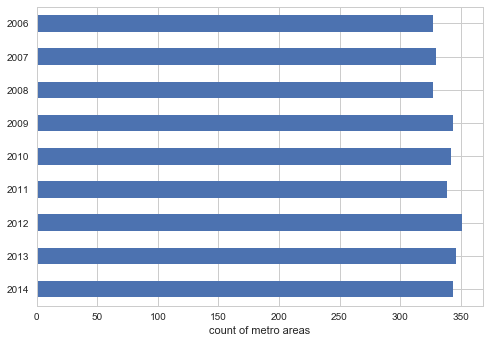


```python
df_crime = df_crime[ df_crime.year<2015]
year_data = df_crime[['year','murder_fbi']]

year_summary = year_data.groupby('year')

#year_summary.head()

year_totals = year_summary.sum()
year_totals['year'] = year_totals.index

print(year_totals.shape)
year_totals


```


    (9, 2)


<div>
<style>
    .dataframe thead tr:only-child th {
        text-align: right;
    }

    .dataframe thead th {
        text-align: left;
    }

    .dataframe tbody tr th {
        vertical-align: top;
    }
</style>
<table border="1" class="dataframe">
  <thead>
    <tr style="text-align: right;">
      <th></th>
      <th>murder_fbi</th>
      <th>year</th>
    </tr>
    <tr>
      <th>year</th>
      <th></th>
      <th></th>
    </tr>
  </thead>
  <tbody>
    <tr>
      <th>2006</th>
      <td>14004.0</td>
      <td>2006</td>
    </tr>
    <tr>
      <th>2007</th>
      <td>13792.0</td>
      <td>2007</td>
    </tr>
    <tr>
      <th>2008</th>
      <td>12614.0</td>
      <td>2008</td>
    </tr>
    <tr>
      <th>2009</th>
      <td>12286.0</td>
      <td>2009</td>
    </tr>
    <tr>
      <th>2010</th>
      <td>11808.0</td>
      <td>2010</td>
    </tr>
    <tr>
      <th>2011</th>
      <td>12391.0</td>
      <td>2011</td>
    </tr>
    <tr>
      <th>2012</th>
      <td>12547.0</td>
      <td>2012</td>
    </tr>
    <tr>
      <th>2013</th>
      <td>12014.0</td>
      <td>2013</td>
    </tr>
    <tr>
      <th>2014</th>
      <td>11594.0</td>
      <td>2014</td>
    </tr>
  </tbody>
</table>
</div>


```python
plot_total = year_totals.plot(x="year", y ="murder_fbi", legend=False, ylim=(0,15000) )
plot_total.set(xlabel="Year",ylabel="Total murders")
plt.savefig('../EDA/total_murders_y_fixed')
```


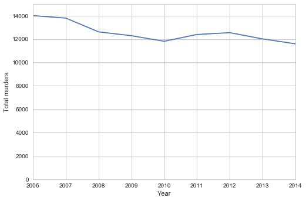


```python
plot_pop = df_crime.plot(x="ln_pop", y="murder_pc", kind="scatter",alpha=0.5)
plot_pop.set(xlabel="Log of population",ylabel="Murder per 1000")
#sns.lmplot("ln_pop", "murder_pc", data=df_crime, fit_reg=True)
plt.savefig('../EDA/population_murder_pc')
```


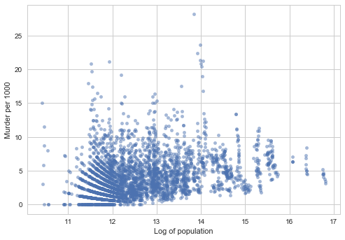


```python
d_name_change = {
    "S01_HC01_EST_VC27":"pop_16over",
    "S01_HC01_EST_VC01":"ln_pop_total_census",
    "S06_HC01_EST_VC63":"income_median",
    "S05_HC01_EST_VC143":"poverty_rate",
    "S23_HC04_EST_VC44":"unemployment_16over",
   "S01_HC01_EST_VC36":"demog_sex_ratio",
      "S01_HC01_EST_VC39":"demog_child_dep_ratio",
     "S05_HC01_EST_VC21":"demog_black",
    "S05_HC01_EST_VC22":"demog_amerindian",
    "S05_HC01_EST_VC54":"education_over25_lessthanhs",
    "S05_HC01_EST_VC53":"pop_over25"
    
}

x_of_interest = list(d_name_change.values())

df_crime = df_crime.rename(columns=d_name_change)


```


```python
df_pair_plot = df_crime[x_of_interest + ["murder_pc"] ]
df_pair_plot["pop_16over"] = pd.to_numeric(df_pair_plot["pop_16over"],errors='coerce') 
df_pair_plot["unemployment_16over"] = pd.to_numeric(df_pair_plot["unemployment_16over"],errors='coerce') 

df_pair_plot.apply(lambda x: sum(np.isnan(x)))
```


    pop_over25                     2592
    demog_amerindian               2406
    pop_16over                       41
    poverty_rate                   2592
    income_median                  1354
    ln_pop_total_census              40
    demog_sex_ratio                  40
    demog_black                    2406
    unemployment_16over            3050
    education_over25_lessthanhs    2592
    demog_child_dep_ratio            40
    murder_pc                         0
    dtype: int64


```python
for s_x in x_of_interest:
    df_local = df_pair_plot[ [s_x,"murder_pc"]]
    df_local= df_local.dropna()
    sns.lmplot(s_x, "murder_pc", data=df_local, fit_reg=True ) 
    plt.savefig('../EDA/bivariage_'+s_x)
    plt.show()
```


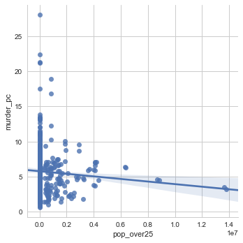


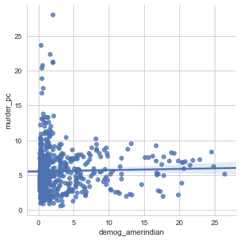


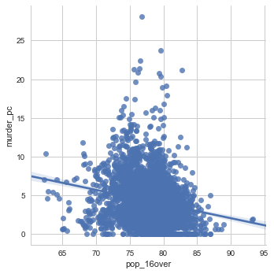


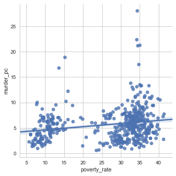


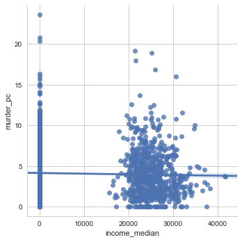


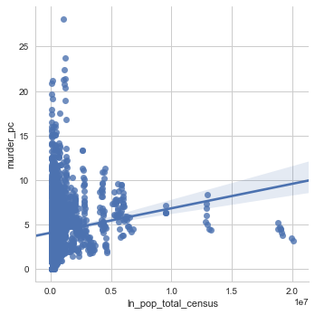


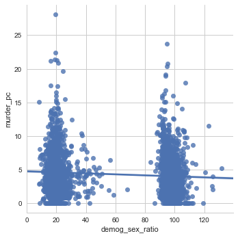


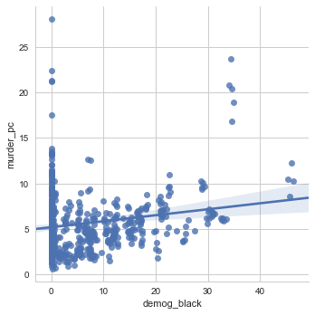


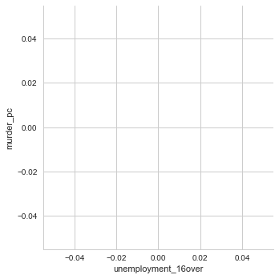


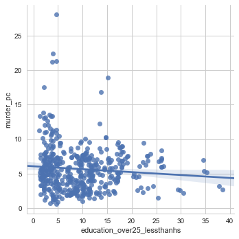


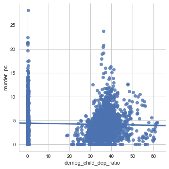


** Total murders by year **


```python


murder_pc = df_crime.murder_pc

f, ax = plt.subplots(1, 1, figsize=(10, 6))
sns.despine(left=True)

sns.distplot(murder_pc, kde=False, bins=18, color="m", ax=ax)
ax.set_title("Distribution of Murder Rate")
ax.set_xlabel("Murder Rate (per 100K)")
f.savefig('../EDA/histogram of murder rate to 2014')
```


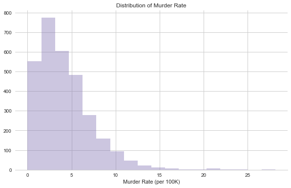


** Population vs. Murders **

Scatterplot (2016)

### Census Data Analysis


```python
sns.set(style="white", color_codes=True)

g = sns.lmplot("ln_pop_total", "murder_pc", data=df_eda, fit_reg=True)
#g.set_titles("test")
g.savefig('../EDA/scatter reg_murder by pop_census')
```


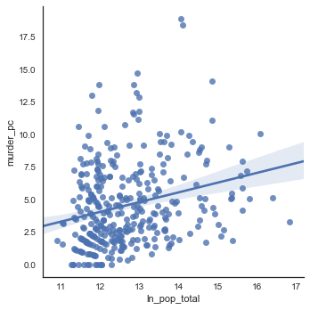


** Histogram **


```python
print(df_eda.shape)
df_eda_nomissing = df_eda.dropna(subset=['murder_pc'])


f, ax = plt.subplots(1, 1, figsize=(10, 6))
sns.despine(left=True)

sns.distplot(df_eda_nomissing['murder_pc'], kde=False, bins=18, color="m", ax=ax)
ax.set_title("Distribution of Murder Rates (2016)")
ax.set_xlabel("Murder Rate (per 100K)")
f.savefig('../EDA/histogram of murder rate')
```


    (382, 17)


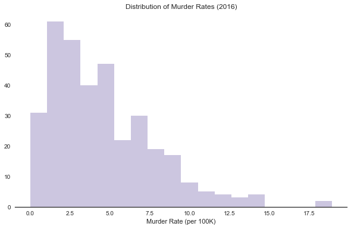


```python
g = sns.distplot(df_eda_nomissing['murder_pc'], kde=False, bins=18, color="m", ax=ax)
#ax.set_title("Distribution of Murder Rates (2016)")
#ax.set_xlabel("Murder Rate (per 100K)")
#g.savefig('../EDA/histogram of murder rate')
```


** Income **


```python
fig, ax = plt.subplots(1,1, figsize=(12,6))

ax = plt.scatter(df_eda['income_hh_median'], df_eda['murder_pc'], alpha=0.75)
plt.title('2016 murder rate by median HH income')
plt.xlabel('Median HH Income')
plt.ylabel('Murders per 100K')
plt.savefig('../EDA/scatter_murder by HH income')
```


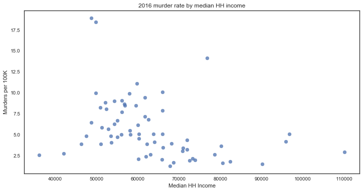


```python
sns.set(style="white", color_codes=True)

g = sns.lmplot("income_hh_median", "murder_pc", data=df_eda, fit_reg=True)
#g.set_titles("test")
g.savefig('../EDA/scatter reg_murder by HH income')
```


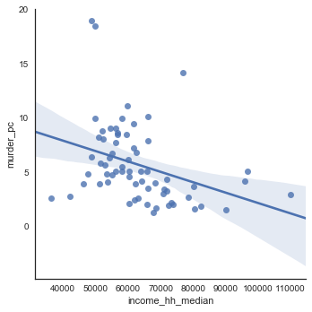


```python
fig, ax = plt.subplots(1,1, figsize=(12,6))

ax = plt.scatter(df_eda['poverty_rate_18over'], df_eda['murder_pc'], alpha=0.75)
plt.title('2016 murder rate by 18+ poverty rate')
plt.xlabel('Poverty Rate (18+)')
plt.ylabel('Murders per 100K')
plt.savefig('../EDA/scatter_murder by poverty rate')
```


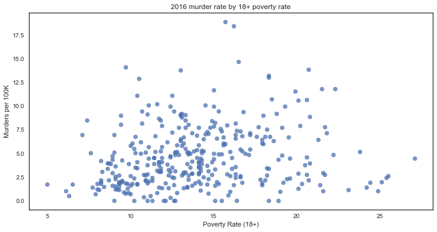


```python
sns.set(style="white", color_codes=True)

g = sns.lmplot("poverty_rate_18over", "murder_pc", data=df_eda, fit_reg=True)
#g.set_titles("test")
g.savefig('../EDA/scatter reg_murder by poverty rate')
```


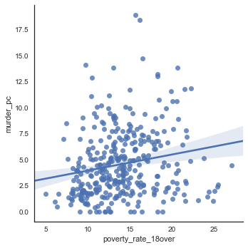


```python


```


** Other Demographics **


```python
sns.set(style="white", color_codes=True)

g = sns.lmplot("demog_black", "murder_pc", data=df_eda, fit_reg=True)
#g.set_titles("test")
g.savefig('../EDA/scatter reg_murder by race=black')
```


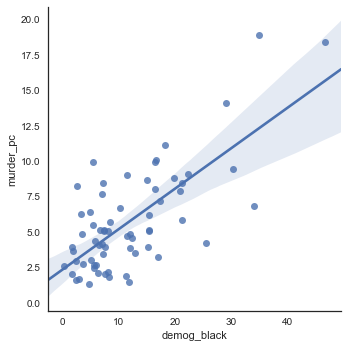


```python
fig, ax = plt.subplots(1,1, figsize=(12,6))

ax = plt.scatter(df_eda['demog_black'], df_eda['murder_pc'], alpha=0.75)
plt.title('2016 murder rate by % black population')
plt.xlabel('African American Population (%)')
plt.ylabel('Murders per 100K')
plt.savefig('../EDA/scatter_murder by race=black')
```


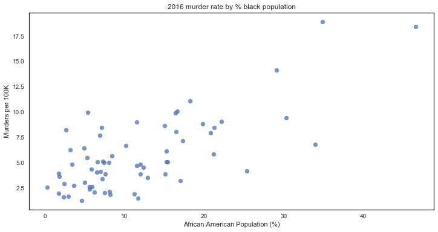


```python

sns.set(style="white", color_codes=True)

g = sns.lmplot("demog_amerindian", "murder_pc", data=df_eda, fit_reg=True)
#g.set_titles("test")
g.savefig('../EDA/scatter reg_murder by race=amerindian')
```


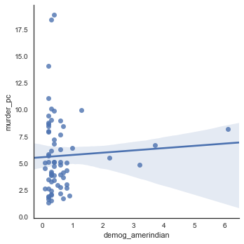


```python

sns.set(style="white", color_codes=True)

g = sns.lmplot("education_over25_lessthanhs", "murder_pc", data=df_eda, fit_reg=True)
#g.set_titles("test")
g.savefig('../EDA/scatter reg_murder by % over 25 lacking HS diploma')
```


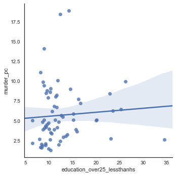


```python
fig, ax = plt.subplots(1,1, figsize=(12,6))

ax = plt.scatter(df_eda['demog_black'], df_eda['murder_pc'], alpha=0.75)
plt.title('2016 murder rate by % lacking HS diploma')
plt.xlabel('% >25yrs without HS diploma')
plt.ylabel('Murders per 100K')
plt.savefig('scatter_murder by % over 25 lacking HS diploma')
```


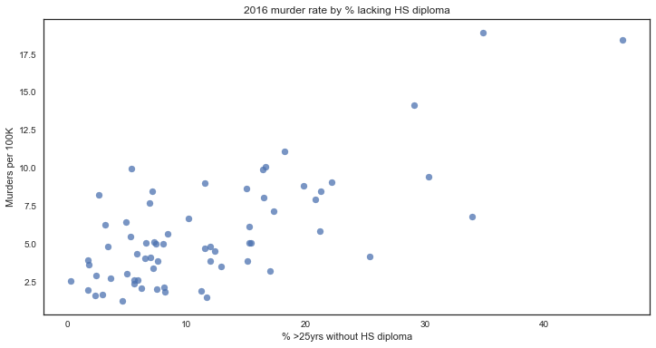


```python

y = df_eda['murder_pc']
X = df_eda[['ln_pop_total', 'poverty_rate_18over']]

X = sm.add_constant(X)

est = sm.OLS(y, X, missing='drop')

results_temp = est.fit()

print(results_temp.summary())
```


                                OLS Regression Results                            
    ==============================================================================
    Dep. Variable:              murder_pc   R-squared:                       0.128
    Model:                            OLS   Adj. R-squared:                  0.123
    Method:                 Least Squares   F-statistic:                     25.27
    Date:                Mon, 27 Nov 2017   Prob (F-statistic):           5.71e-11
    Time:                        20:08:25   Log-Likelihood:                -877.93
    No. Observations:                 348   AIC:                             1762.
    Df Residuals:                     345   BIC:                             1773.
    Df Model:                           2                                         
    Covariance Type:            nonrobust                                         
    =======================================================================================
                              coef    std err          t      P>|t|      [0.025      0.975]
    ---------------------------------------------------------------------------------------
    const                  -9.9404      2.130     -4.667      0.000     -14.130      -5.751
    ln_pop_total            0.9138      0.151      6.033      0.000       0.616       1.212
    poverty_rate_18over     0.2088      0.042      4.985      0.000       0.126       0.291
    ==============================================================================
    Omnibus:                       57.441   Durbin-Watson:                   2.130
    Prob(Omnibus):                  0.000   Jarque-Bera (JB):               87.976
    Skew:                           1.016   Prob(JB):                     7.88e-20
    Kurtosis:                       4.393   Cond. No.                         251.
    ==============================================================================
    
    Warnings:
    [1] Standard Errors assume that the covariance matrix of the errors is correctly specified.


```python

y = df_eda['murder_pc']
X = df_eda[['ln_pop_total', 'income_hh_median', 'poverty_rate_18over', 'demog_black', 'demog_amerindian', 'education_over25_lessthanhs']]

X = sm.add_constant(X)

est = sm.OLS(y, X, missing='drop')

results_temp = est.fit()

print(results_temp.summary())
```


                                OLS Regression Results                            
    ==============================================================================
    Dep. Variable:              murder_pc   R-squared:                       0.664
    Model:                            OLS   Adj. R-squared:                  0.630
    Method:                 Least Squares   F-statistic:                     19.41
    Date:                Mon, 27 Nov 2017   Prob (F-statistic):           2.38e-12
    Time:                        20:01:25   Log-Likelihood:                -142.03
    No. Observations:                  66   AIC:                             298.1
    Df Residuals:                      59   BIC:                             313.4
    Df Model:                           6                                         
    Covariance Type:            nonrobust                                         
    ===============================================================================================
                                      coef    std err          t      P>|t|      [0.025      0.975]
    -----------------------------------------------------------------------------------------------
    const                           8.2081      5.741      1.430      0.158      -3.280      19.696
    ln_pop_total                   -0.3546      0.375     -0.945      0.348      -1.105       0.396
    income_hh_median            -4.393e-05   3.44e-05     -1.275      0.207      -0.000     2.5e-05
    poverty_rate_18over            -0.1196      0.211     -0.567      0.573      -0.542       0.303
    demog_black                     0.3387      0.037      9.213      0.000       0.265       0.412
    demog_amerindian                0.9781      0.336      2.911      0.005       0.306       1.650
    education_over25_lessthanhs     0.1803      0.100      1.800      0.077      -0.020       0.381
    ==============================================================================
    Omnibus:                        0.335   Durbin-Watson:                   2.045
    Prob(Omnibus):                  0.846   Jarque-Bera (JB):                0.051
    Skew:                           0.048   Prob(JB):                        0.975
    Kurtosis:                       3.098   Cond. No.                     1.36e+06
    ==============================================================================
    
    Warnings:
    [1] Standard Errors assume that the covariance matrix of the errors is correctly specified.
    [2] The condition number is large, 1.36e+06. This might indicate that there are
    strong multicollinearity or other numerical problems.


```python

y = df_eda['murder_pc']
X = df_eda[['ln_pop_total', 'pop_16over', 'demog_sex_ratio', 'demog_child_dep_ratio']]

X = sm.add_constant(X)

est = sm.OLS(y, X, missing='drop')

results_temp = est.fit()

print(results_temp.summary())
```


                                OLS Regression Results                            
    ==============================================================================
    Dep. Variable:              murder_pc   R-squared:                       0.193
    Model:                            OLS   Adj. R-squared:                  0.183
    Method:                 Least Squares   F-statistic:                     19.00
    Date:                Mon, 27 Nov 2017   Prob (F-statistic):           5.00e-14
    Time:                        20:19:14   Log-Likelihood:                -817.68
    No. Observations:                 323   AIC:                             1645.
    Df Residuals:                     318   BIC:                             1664.
    Df Model:                           4                                         
    Covariance Type:            nonrobust                                         
    =========================================================================================
                                coef    std err          t      P>|t|      [0.025      0.975]
    -----------------------------------------------------------------------------------------
    const                    27.2326     25.429      1.071      0.285     -22.798      77.263
    ln_pop_total              0.9987      0.169      5.922      0.000       0.667       1.331
    pop_16over               -0.2405      0.239     -1.006      0.315      -0.711       0.230
    demog_sex_ratio          -0.1631      0.041     -3.965      0.000      -0.244      -0.082
    demog_child_dep_ratio    -0.0137      0.115     -0.119      0.905      -0.239       0.212
    ==============================================================================
    Omnibus:                      116.918   Durbin-Watson:                   2.036
    Prob(Omnibus):                  0.000   Jarque-Bera (JB):              458.029
    Skew:                           1.531   Prob(JB):                    3.47e-100
    Kurtosis:                       7.965   Cond. No.                     1.96e+04
    ==============================================================================
    
    Warnings:
    [1] Standard Errors assume that the covariance matrix of the errors is correctly specified.
    [2] The condition number is large, 1.96e+04. This might indicate that there are
    strong multicollinearity or other numerical problems.


```python

Total; Estimate; Total households
Total; Estimate; Total population

Total; Estimate; Total population - SELECTED AGE CATEGORIES - 16 years and over
Total; Estimate; Total population - SUMMARY INDICATORS - Sex ratio (males per 100 females)

Total; Estimate; Total population - SUMMARY INDICATORS - Child dependency ratio


Total; Estimate; EARNINGS IN THE PAST 12 MONTHS (IN 2006 INFLATION-ADJUSTED DOLLARS) FOR FULL-TIME, YEAR-ROUND WORKERS - Population 16 years and over with earnings - Median earnings (dollars) for full-time, year-round workers: - Female
Total; Estimate; EARNINGS IN THE PAST 12 MONTHS (IN 2006 INFLATION-ADJUSTED DOLLARS) FOR FULL-TIME, YEAR-ROUND WORKERS - Population 16 years and over with earnings - Median earnings (dollars) for full-time, year-round workers: - Male
Total; Estimate; Median Household income (dollars)
Total; Estimate; Median earnings (dollars) for full-time, year-round workers: - Female
Total; Estimate; Median earnings (dollars) for full-time, year-round workers: - Male

Percent; Estimate; POVERTY STATUS IN THE PAST 12 MONTHS - Civilian population 18 years and over for whom poverty status is determined - Income in the past 12 months below poverty level

Unemployment rate; Estimate; PERCENT IMPUTED - Employment status for population 16 years and over
Total; Estimate; EMPLOYMENT STATUS - Population 16 years and over - In labor force - Civilian labor force - Unemployed - Percent of civilian labor force


Total; Estimate; Median number of rooms

Total; Estimate; EDUCATIONAL ATTAINMENT - Population 25 years and over - Less than high school graduate
Total; Estimate; EDUCATIONAL ATTAINMENT - Population 25 years and over

Total; Estimate; RACE AND HISPANIC OR LATINO ORIGIN - One race - American Indian and Alaska Native
Total; Estimate; RACE AND HISPANIC OR LATINO ORIGIN - One race - Black or African American


```

