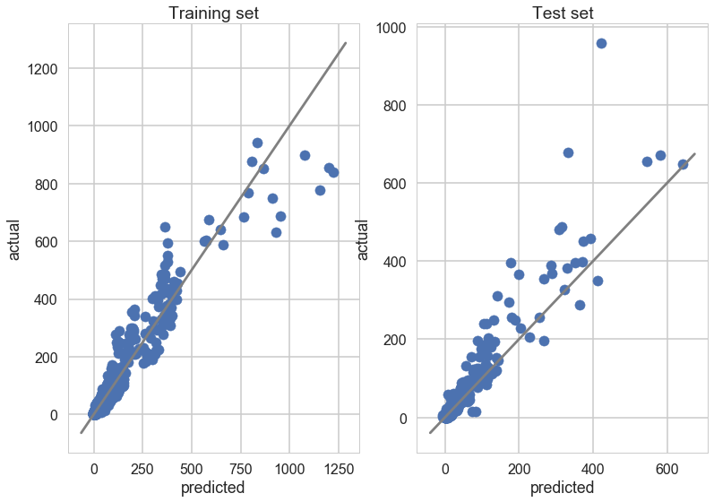
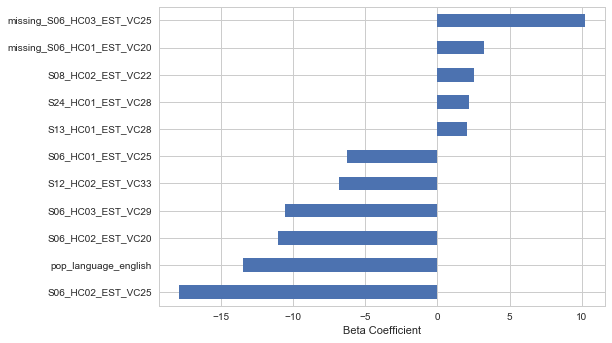

## Contents
{:.no_toc}
*  
{: toc}

Our aim is to predict the numbers of murders in each MSA in a given year using Census and BLS data for the previous year. In principle the resulting model should be useful for making budgetary decisions about law enforcement and corrections spending in advance. Consequently, we use the following strategy to evaluate models:
1) Use data from year $t$ to predict the number of murders in year $t+1$ (all our x variables have lag 1).
2) Hold apart the number of murders in years 2015 and 2016 as a test set to evaluate the final model. It is better to reserve the latest available years because we expect them to have the most in common with future years for which the model can be employed. 

Initially we report results for both the murder rate and the number of murders. 

## Baseline ("Very simple") Model

As a reference baseline case, we use an OLS regression on the three variables suggested in the prompt:
- sex ratio
- median age
- median income

Performance in terms of $R^2$:

<table border="1" class="dataframe">
  <thead>
    <tr style="text-align: right;">
      <th></th>
      <th>Murder count</th>
      <th>Murder rate</th>
    </tr>
  </thead>
  <tbody>
    <tr>
      <th>In sample</th>
      <td>0.817760</td>
      <td>0.055445</td>
    </tr>
    <tr>
      <th>Out-of-sample</th>
      <td>0.747537</td>
      <td>0.030111</td>
    </tr>
  </tbody>
</table>

## Extension: EDA-Informed ("Simple") Model

As the first extension, we add several variables to the OLS that were supported by exploratory analysis:
- English-language speakers
- Citizenship status
- Residents who moved within the county
- Residents who moved from a different county
- Residents relying on public_transportation
- Average travel time to work

Performance in terms of $R^2$:

<table border="1" class="dataframe">
  <thead>
    <tr style="text-align: right;">
      <th></th>
      <th>Murder count</th>
      <th>Murder rate</th>
    </tr>
  </thead>
  <tbody>
    <tr>
      <th>In sample</th>
      <td>0.856380</td>
      <td>0.158388</td>
    </tr>
    <tr>
      <th>Out-of-sample</th>
      <td>0.823235</td>
      <td>0.109559</td>
    </tr>
  </tbody>
</table>

From this point forward we report results in terms of the _murder count_ rather than the _murder rate_ because this is closest to our original question and performance on the count is greater.

## Advanced models

To move beyond the small OLS models of intuitively plausible variables, we employ:
- regularization or decision trees (in AdaBoost) to cope with a large number of potential features (approximately 1440)
- cross-validation to select a model and parameters.

In particular, we jointly select the best algorithm and parameters through cross validation. The algorithms we include are:
- Lasso 
- Ridge
- ElasticNet (because we heard this can perform better when there are too many predictors and few observations, as we have here)
- AdaBoost

### Performance

The results, in terms of average $R^2$ across the 3-fold cross-validation sets are as follows:

<table border="1" class="dataframe">
  <thead>
    <tr style="text-align: right;">
      <th></th>
      <th>r2</th>
    </tr>
    <tr>
      <th>model</th>
      <th></th>
    </tr>
  </thead>
  <tbody>
    <tr>
      <th>Lasso alpha:0.1</th>
      <td>0.896383</td>
    </tr>
    <tr>
      <th>Elastic ratio:0.9 , alpha:0.1</th>
      <td>0.892084</td>
    </tr>
    <tr>
      <th>Ridge alpha:1000.0</th>
      <td>0.890841</td>
    </tr>
    <tr>
      <th>Elastic ratio:0.7 , alpha:0.1</th>
      <td>0.888808</td>
    </tr>
    <tr>
      <th>Elastic ratio:0.1 , alpha:1.0</th>
      <td>0.887917</td>
    </tr>
    <tr>
      <th>Elastic ratio:0.3 , alpha:1.0</th>
      <td>0.887770</td>
    </tr>
    <tr>
      <th>Elastic ratio:0.5 , alpha:1.0</th>
      <td>0.885713</td>
    </tr>
    <tr>
      <th>Elastic ratio:0.5 , alpha:0.1</th>
      <td>0.885675</td>
    </tr>
    <tr>
      <th>Elastic ratio:0.3 , alpha:0.1</th>
      <td>0.883998</td>
    </tr>
  </tbody>
</table>

Evaluating the best model on the test set produces:

    R squared of best model in test set:
     Lasso alpha:0.1
    0.853266617989

Because the $R^2$ in the validation set is slightly better than in the test set, there is some indication of minor overfitting. However, this is a significantly smaller gap than observed in the baseline and simple extension model. Overfitting has been reduced, even though we have employed many more features. 

Importantly, performance is still very high, so we can be quite confident we have developed a strong-performing model. Broadly this represents a triumph of data-driven, automated processes over careful reflection.

### Interpretation

The figures below shows the performance of the champion model by plotting predicted against average number of murders. The gray diagonal lines correspond to correct predictions. 

Interestingly, in the training set, the model performs comparatively poorly on MSAs with a large number of murders, systematically overestimating the number of murders. But this problem is *not* found in the test set. Regularization has been largely successful.

Because Ridge is an extension of OLS, it is easy to interpret the coefficients on each of the variables, shown below:

<table border="1" class="dataframe">
  <thead>
    <tr style="text-align: right;">
      <th></th>
      <th>coef</th>
      <th>variable</th>
      <th>description</th>
    </tr>
  </thead>
  <tbody>
    <tr>
      <th>0</th>
      <td>-17.893939</td>
      <td>S06_HC02_EST_VC25</td>
      <td>Native; born in state of residence; Estimate; ...</td>
    </tr>
    <tr>
      <th>1</th>
      <td>-13.458215</td>
      <td>pop_language_english</td>
      <td>Total English speakers</td>
    </tr>
    <tr>
      <th>2</th>
      <td>-11.053142</td>
      <td>S06_HC02_EST_VC20</td>
      <td>Native; born in state of residence; Estimate; ...</td>
    </tr>
    <tr>
      <th>3</th>
      <td>-10.569383</td>
      <td>S06_HC03_EST_VC29</td>
      <td>Native; born in other state in the U.S.; Estim...</td>
    </tr>
    <tr>
      <th>4</th>
      <td>-6.791582</td>
      <td>S12_HC02_EST_VC33</td>
      <td>Now married (except separated); Estimate; NATI...</td>
    </tr>
    <tr>
      <th>5</th>
      <td>-6.242251</td>
      <td>S06_HC01_EST_VC25</td>
      <td>Total; Estimate; RACE AND HISPANIC OR LATINO O...</td>
    </tr>
    <tr>
      <th>6</th>
      <td>-4.989624</td>
      <td>S06_HC03_EST_VC25</td>
      <td>Native; born in other state in the U.S.; Estim...</td>
    </tr>
    <tr>
      <th>7</th>
      <td>-4.748157</td>
      <td>S12_HC01_EST_VC30</td>
      <td>Total; Estimate; White alone, not Hispanic or ...</td>
    </tr>
    <tr>
      <th>1134</th>
      <td>2.044579</td>
      <td>S25_HC02_EST_VC24</td>
      <td>Owner-occupied housing units; Estimate; HOUSEH...</td>
    </tr>
    <tr>
      <th>1133</th>
      <td>2.001245</td>
      <td>S19_HC03_EST_VC13</td>
      <td>Married-couple families; Estimate; Median inco...</td>
    </tr>
    <tr>
      <th>1135</th>
      <td>2.045913</td>
      <td>S13_HC01_EST_VC28</td>
      <td>Total; Estimate; EDUCATIONAL ATTAINMENT - Grad...</td>
    </tr>
    <tr>
      <th>1136</th>
      <td>2.198169</td>
      <td>S24_HC01_EST_VC28</td>
      <td>Total; Estimate; Sales and office occupations:...</td>
    </tr>
    <tr>
      <th>1137</th>
      <td>2.515365</td>
      <td>S08_HC02_EST_VC22</td>
      <td>Male; Estimate; Living in a place</td>
    </tr>
    <tr>
      <th>1139</th>
      <td>3.225564</td>
      <td>missing_S06_HC01_EST_VC20</td>
      <td>>Missing: Population Total; White Only</td>
    </tr>
    <tr>
      <th>1140</th>
      <td>10.212589</td>
      <td>missing_S06_HC03_EST_VC25</td>
      <td>>Missing: Population Total; Other race</td>
    </tr>
  </tbody>
</table>

Visually:

Notably these values are quite large (many MSAs only had 10 or fewer murders). This suggests that these features are doing real "work" in the prediction, which is not therefore driven exclusively by the total population term.

## Conclusions

We saw that the number and rates of murders is not a random phenomenon in aggregate.
Rather, demographic and economic predictors are pretty good at forecasting next-year murder rates, and even our "very simple" model of three variables (and population) achieved an $R^2$ of 0.75.
However, a "ceiling" did seem to be approached through linear regression model with census and unemployment data, and our best model achieved an $R^2$ of 0.85.

A strength of our approach was its relative linear-regression simplicity that allowed for straight-forward identification of predictive covariates and interpretation of their predictive power in our models.
Additionally, iterative addition of variables and complexity (ridge and lasso to regularize our regressions from a pool of thousands of predictor variables) helped us see the relative utility of additional variables and diminishing returns to higher orders of model and validation complexity.

<u>Room for improvement</u>

Methodologically, we could improve our model by working more on ensemble models that would be better at homing in on characteristics of metro areas in which crime is difficult to predict on the first pass.
We included AdaBoost but did not explore stacking or random forest methods.

The approaches we tried kept our focus exclusively at the MSA-level of observation.
It is possible that higher level factors (states or climatic zones) might play a large role.
If so, hierarchical modeling approaches would have improved model performance.

One big question for further exploration is why our model performs so poorly at predicting murder *rates* directly (rather than counts, which could be used to calculate rates).
To do this, we would need to better understand scaling effects to determine how our count- or proportion-based predictor variables could best be leveraged to model murder rates.

Our forecasting model could potentially be improved by adding additional predictor indicators at the state, MSA, or county levels.
In addition to economic indicators, we could add data from other sources (or calculate new variables) on gun ownership, lead history, year-to-year changes in demographics, historic abortion rates, and drug cases at hospitals.

Apart from adding conceptually new variables, we could also explore interactive effects between variables (with interaction terms), non-linear effects (with polynomial terms), or fixed effects of geographic units like US states.
And we could use more of the census data if we imputed missing values and completed additional data cleaning (reconciling variables with different names across year-to-year datasets that described the same thing).
Additional dummies could be created based on variable missing-ness to allow for inclusion of more variables that exist for some years but not for others.

## Methodological Appendix

In addition to the procedures described above:
- Missing data were imputed when fewer than 20% of observations were available
- When imputing data we took the mean of the training set and added a corresponding dummy variable
- Features were standardized to the mean and standard deviation of the training set
