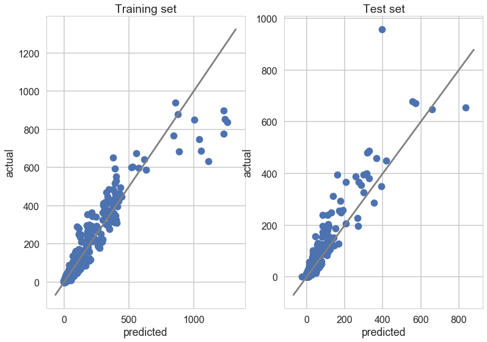
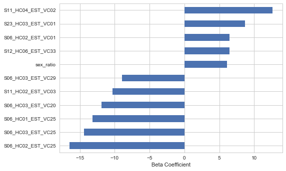

# Predictive Modeling

## Baseline ("Very simple") Model

As a reference baseline case, we use an OLS regression on the three variables suggested in the prompt:
- sex ratio
- median age
- median income

Performance in terms of $R^2$:


<div>
<style>
    .dataframe thead tr:only-child th {
        text-align: right;
    }

    .dataframe thead th {
        text-align: left;
    }

    .dataframe tbody tr th {
        vertical-align: top;
    }
</style>
<table border="1" class="dataframe">
  <thead>
    <tr style="text-align: right;">
      <th></th>
      <th>Murder count</th>
      <th>Murder rate</th>
    </tr>
  </thead>
  <tbody>
    <tr>
      <th>In sample</th>
      <td>0.862041</td>
      <td>0.113483</td>
    </tr>
    <tr>
      <th>Out-of-sample</th>
      <td>0.781324</td>
      <td>0.085333</td>
    </tr>
  </tbody>
</table>
</div>


## Extension: EDA-Informed ("Simple") Model

As the first extension, we add several variables to the OLS that were supported by exploratory analysis:
- English-language speakers
- Citizenship status
- Residents who moved within the county
- Residents who moved from a different county
- Residents relying on public_transportation
- Average travel time to work

Performance in terms of $R^2$:


```python
pd.reset_option("display.float_format")

# print("R2 at a murder count level")
ols_model = LinearRegression() 
ols_model.fit(x_train[vars_small_model],y_train)
vs_trn_nr = calc_rsquared(ols_model,x_train[vars_small_model],y_train,population_train)
vs_tst_nr = calc_rsquared(ols_model,x_test[vars_small_model],y_test,population_test)

# print("R2 at a murder rate level")
ols_model.fit(x_train[vars_small_model],y_train)
vs_trn_rt = r2_score(y_train,ols_model.predict(x_train[vars_small_model]))
vs_tst_rt = r2_score(y_test,ols_model.predict(x_test[vars_small_model]))
d = {
    'In sample': [
        vs_trn_nr,
        vs_trn_rt
    ], 'Out-of-sample': [
        vs_tst_nr,
        vs_tst_rt
    ]
}
tab = pd.DataFrame.from_dict(d, orient="index")
tab.columns = ["Murder count", "Murder rate"]
tab
```


<div>
<style>
    .dataframe thead tr:only-child th {
        text-align: right;
    }

    .dataframe thead th {
        text-align: left;
    }

    .dataframe tbody tr th {
        vertical-align: top;
    }
</style>
<table border="1" class="dataframe">
  <thead>
    <tr style="text-align: right;">
      <th></th>
      <th>Murder count</th>
      <th>Murder rate</th>
    </tr>
  </thead>
  <tbody>
    <tr>
      <th>In sample</th>
      <td>0.861738</td>
      <td>0.128967</td>
    </tr>
    <tr>
      <th>Out-of-sample</th>
      <td>0.782953</td>
      <td>0.102937</td>
    </tr>
  </tbody>
</table>
</div>


From this point forward we report results in terms of the _murder count_ rather than the _murder rate_ because this is closest to our original question and performance on the count is greater.

## Advanced models

To move beyond the small OLS models of intuitively plausible variables, we employ:
- regularization or decision trees (in AdaBoost) to cope with a large number of potential features
- cross-validation to select a model and parameters.

In particular, we jointly select the best algorithm and parameters through cross validation. The algorithms we include are:
- Lasso 
- Ridge
- ElasticNet (because we heard this can perform better when there are too many predictors and few observations, as we have here)
- AdaBoost

### Performance

The results, in terms of average $R^2$ across the 3-fold cross-validation sets are as follows:


<div>
<style>
    .dataframe thead tr:only-child th {
        text-align: right;
    }

    .dataframe thead th {
        text-align: left;
    }

    .dataframe tbody tr th {
        vertical-align: top;
    }
</style>
<table border="1" class="dataframe">
  <thead>
    <tr style="text-align: right;">
      <th></th>
      <th>r2</th>
    </tr>
    <tr>
      <th>model</th>
      <th></th>
    </tr>
  </thead>
  <tbody>
    <tr>
      <th>Ridge alpha:10.0</th>
      <td>0.864557</td>
    </tr>
    <tr>
      <th>Elastic ratio:0.5 , alpha:0.01</th>
      <td>0.863767</td>
    </tr>
    <tr>
      <th>Elastic ratio:0.3 , alpha:0.01</th>
      <td>0.863436</td>
    </tr>
    <tr>
      <th>Elastic ratio:0.1 , alpha:0.01</th>
      <td>0.862874</td>
    </tr>
    <tr>
      <th>Elastic ratio:0.7 , alpha:0.01</th>
      <td>0.862690</td>
    </tr>
    <tr>
      <th>Elastic ratio:0.9 , alpha:0.1</th>
      <td>0.862421</td>
    </tr>
    <tr>
      <th>Lasso alpha:0.1</th>
      <td>0.861477</td>
    </tr>
    <tr>
      <th>Ridge alpha:100.0</th>
      <td>0.860444</td>
    </tr>
    <tr>
      <th>Elastic ratio:0.7 , alpha:0.1</th>
      <td>0.859598</td>
    </tr>
  </tbody>
</table>
</div>


Evaluating the best model on the test set produces:


    R squared of best model in test set:
     Ridge alpha:10.0
    0.850537508869


Because the $R^2$ in the validation set is slightly better than in the test set, there is some indication of minor overfitting. However, this is a significantly smaller gap than observed in the baseline and simple extension model. Overfitting has been reduced, even though we have employed many more features. 

Importantly, performance is still very high, so we can be quite confident we have developed a strong-performing model. Broadly this represents a triumph of data-driven, automated processes over careful reflection.

### Interpretation

The figures below shows the performance of the champion model by plotting predicted against average number of murders. The gray diagonal lines correspond to correct predictions. 

Interestingly, in the training set, the model performs comparatively poorly on MSAs with a large number of murders, systematically overestimating the number of murders. But this problem is *not* found in the test set. Regularization has been largely successful.





Because Ridge is an extension of OLS, it is easy to interpret the coefficients on each of the variables, shown below:


<div>
<style>
    .dataframe thead tr:only-child th {
        text-align: right;
    }

    .dataframe thead th {
        text-align: left;
    }

    .dataframe tbody tr th {
        vertical-align: top;
    }
</style>
<table border="1" class="dataframe">
  <thead>
    <tr style="text-align: right;">
      <th></th>
      <th>coef</th>
      <th>variable</th>
      <th>description</th>
    </tr>
  </thead>
  <tbody>
    <tr>
      <th>0</th>
      <td>-16.475116</td>
      <td>S06_HC02_EST_VC25</td>
      <td>Native; born in state of residence; Estimate; ...</td>
    </tr>
    <tr>
      <th>1</th>
      <td>-14.404695</td>
      <td>S06_HC03_EST_VC25</td>
      <td>Native; born in other state in the U.S.; Estim...</td>
    </tr>
    <tr>
      <th>2</th>
      <td>-13.172350</td>
      <td>S06_HC01_EST_VC25</td>
      <td>Total; Estimate; RACE AND HISPANIC OR LATINO O...</td>
    </tr>
    <tr>
      <th>3</th>
      <td>-11.911406</td>
      <td>S06_HC03_EST_VC20</td>
      <td>Native; born in other state in the U.S.; Estim...</td>
    </tr>
    <tr>
      <th>4</th>
      <td>-10.335098</td>
      <td>S11_HC02_EST_VC03</td>
      <td>Married-couple family household; Estimate; Ave...</td>
    </tr>
    <tr>
      <th>5</th>
      <td>-8.918582</td>
      <td>S06_HC03_EST_VC29</td>
      <td>Native; born in other state in the U.S.; Estim...</td>
    </tr>
    <tr>
      <th>6</th>
      <td>-8.829600</td>
      <td>S25_HC01_EST_VC24</td>
      <td>Occupied housing units; Estimate; HOUSEHOLD TY...</td>
    </tr>
    <tr>
      <th>7</th>
      <td>-8.739879</td>
      <td>S24_HC01_EST_VC10</td>
      <td>Total; Estimate; Management, business, science...</td>
    </tr>
    <tr>
      <th>1138</th>
      <td>6.064592</td>
      <td>S23_HC02_EST_VC01</td>
      <td>In labor force; Estimate; Population 16 years ...</td>
    </tr>
    <tr>
      <th>1137</th>
      <td>6.004667</td>
      <td>S17_HC03_EST_VC03</td>
      <td>Percent below poverty level; Estimate; AGE - U...</td>
    </tr>
    <tr>
      <th>1139</th>
      <td>6.089652</td>
      <td>sex_ratio</td>
      <td>NaN</td>
    </tr>
    <tr>
      <th>1140</th>
      <td>6.464576</td>
      <td>S12_HC06_EST_VC33</td>
      <td>Never married; Estimate; NATIVITY - Native</td>
    </tr>
    <tr>
      <th>1141</th>
      <td>6.484303</td>
      <td>S06_HC02_EST_VC01</td>
      <td>Native; born in state of residence; Estimate; ...</td>
    </tr>
    <tr>
      <th>1143</th>
      <td>8.691011</td>
      <td>S23_HC03_EST_VC01</td>
      <td>Employed; Estimate; Population 16 years and over</td>
    </tr>
    <tr>
      <th>1144</th>
      <td>12.632328</td>
      <td>S11_HC04_EST_VC02</td>
      <td>Female householder, no husband present, family...</td>
    </tr>
  </tbody>
</table>
</div>


Visually:





## Conclusions
